# 🌌 The Unspeakable World

> The first browser-interactive reference for the known universe — every
> federated sky survey, every named object, every recent space-news
> headline, every famous UAP case, every common space myth, every
> biosignature exoplanet, plus an 8-lesson curriculum that takes a
> curious learner from "Earth spins" to "the cosmic web." 60 fps. MIT.

**🚀 Live:** [unspeakable-world.dashable.dev](https://unspeakable-world.dashable.dev) — open `/#viewer` and drag

[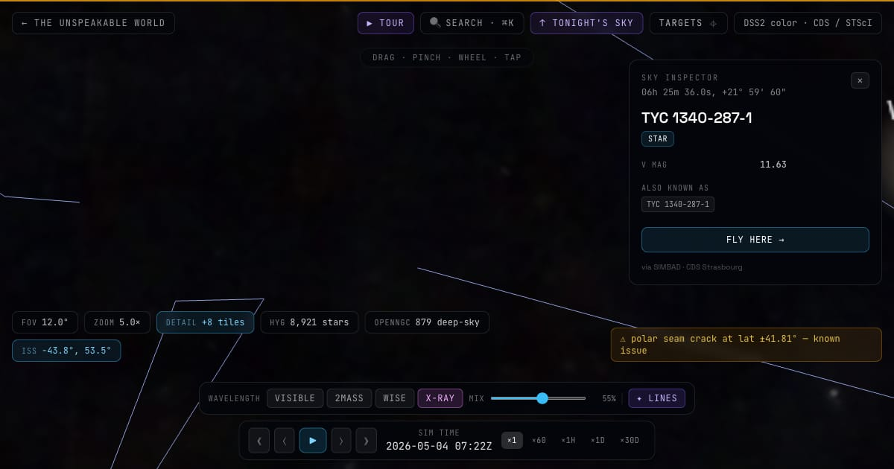](https://unspeakable-world.dashable.dev/#viewer)

---

## 📸 The product, in five frames

<table>
  <tr>
    <td width="50%">
      <a href="docs/screenshots/03-landing.png">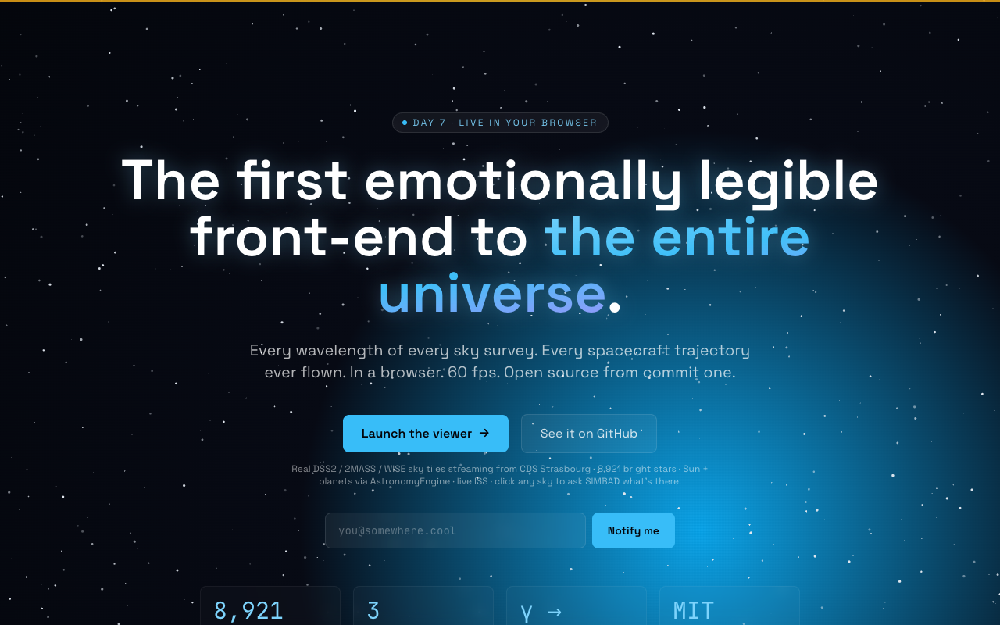</a>
      <br /><sub><b>Landing</b> — APOD daily card + astronomy-today rail + feature highlights.</sub>
    </td>
    <td width="50%">
      <a href="docs/screenshots/01-multiwavelength.png">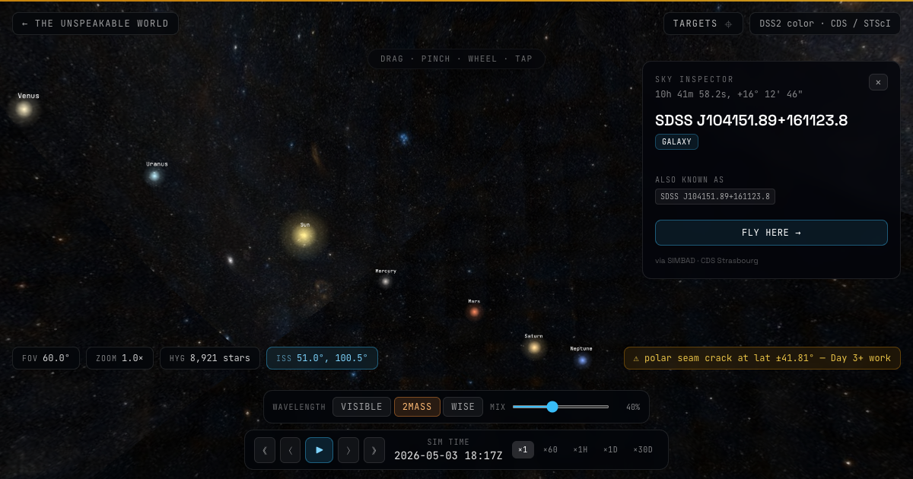</a>
      <br /><sub><b>Multi-wavelength cross-fade</b> — drag the slider to morph DSS2 → 2MASS → WISE → INTEGRAL → GALEX → ROSAT/eROSITA → Planck CMB.</sub>
    </td>
  </tr>
  <tr>
    <td>
      <a href="docs/screenshots/04-constellations.png">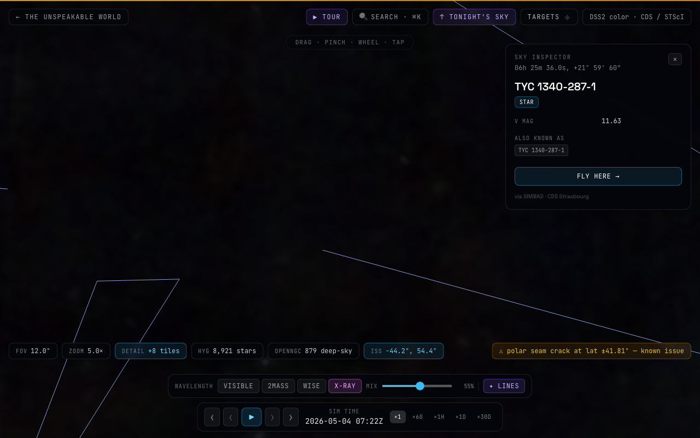</a>
      <br /><sub><b>Constellations</b> — all 88 IAU figures + four cultural traditions (Western · Chinese · Polynesian · Lakota).</sub>
    </td>
    <td>
      <a href="docs/screenshots/05-andromeda-2mass.png"></a>
      <br /><sub><b>Andromeda · 2MASS</b> — federated HiPS tiles let you zoom into any object at survey resolution.</sub>
    </td>
  </tr>
  <tr>
    <td colspan="2">
      <a href="docs/screenshots/02-wise-ir.png">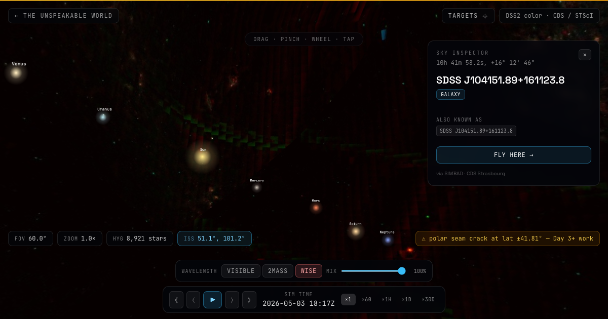</a>
      <br /><sub><b>WISE mid-infrared</b> — the warm dust lane of the Milky Way and every star-forming region the eye can't see.</sub>
    </td>
  </tr>
</table>

> More screenshots welcome — see [docs/screenshots/README.md](docs/screenshots/README.md) for the shot list and how to capture them automatically with `node tools/screenshot.mjs`.

---

## 🆕 v4 in pictures

Ten hero shots from the v4 wave — captured fresh from production at
1920×1080 by `tools/capture-v4-screenshots.mjs`. Every frame is
reproducible from its URL hash + a small localStorage seed; deep-link
each thumbnail to jump straight to that view.

A long-form walkthrough — what each feature does, how to use it, why
it matters — lives in [`docs/FEATURES.md`](docs/FEATURES.md).

<table>
  <tr>
    <td width="50%">
      <a href="https://unspeakable-world.dashable.dev/#universe?cx=26000&cy=0.00079&cz=0&yaw=3.14159&pitch=-1.55">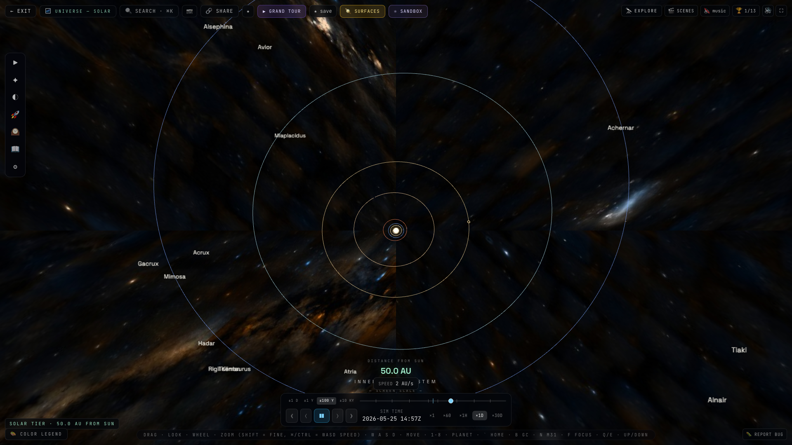</a>
      <br /><sub><b>1,000,000 stars from Gaia DR3</b> — parallax-derived 3D positions, BP-RP→RGB shader, GPU-instanced. Tier HUD reads "Solar Tier · 50.0 AU FROM SUN" — pull out further and the same point cloud restructures into the local stellar neighborhood. → <a href="apps/web/src/viewer/gaia-stars/">source</a></sub>
    </td>
    <td width="50%">
      <a href="https://unspeakable-world.dashable.dev/#viewer?fov=150&ra=180&dec=0&layers=multimessenger&c=1&n=1">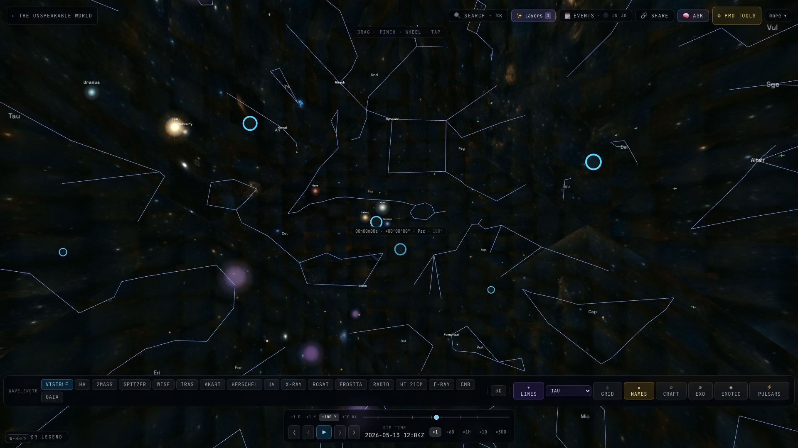</a>
      <br /><sub><b>The multi-messenger sky on one sphere</b> — IceCube neutrinos, Pierre Auger UHECRs, LIGO GWTC-3 90% sky areas (with re-synthesised inspiral chirp audio), and NANOGrav pulsar-timing-array sources, all on the same celestial sphere as the constellation art. → <a href="apps/web/src/viewer/multimessenger/">source</a></sub>
    </td>
  </tr>
  <tr>
    <td>
      <a href="https://unspeakable-world.dashable.dev/#universe?cx=26000&cy=10000000&cz=0&yaw=3.14159&pitch=-1.4">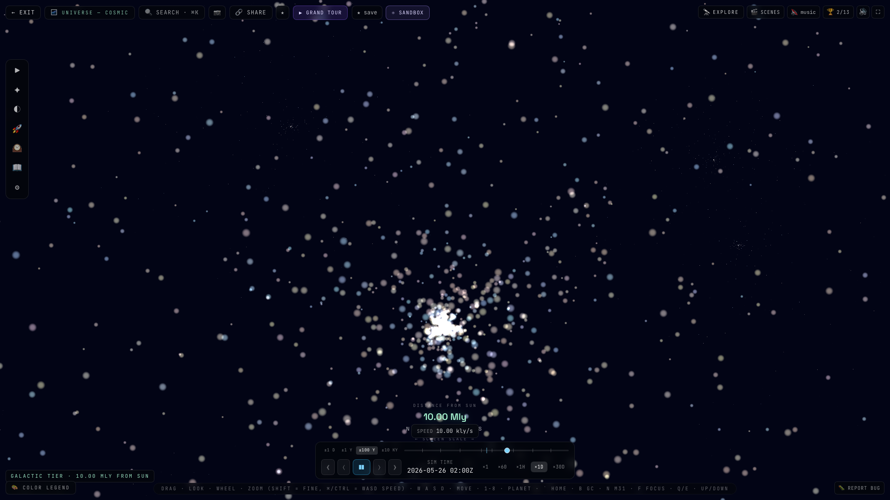</a>
      <br /><sub><b>136,596 galaxies in true 3D</b> — 2MRS + 6dFGS in galactic-LY coordinates, redshift hue gradient, K-band brightness scaling. Fly through the Local Group and the Virgo Cluster scrolls past for real. → <a href="apps/web/src/viewer/galaxy-cone/">source</a></sub>
    </td>
    <td>
      <a href="https://unspeakable-world.dashable.dev/#viewer?fov=3.5&ra=10.6847&dec=41.269&w=2mass&mix=0.9&c=1&n=1">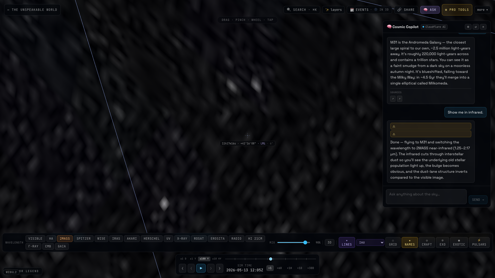</a>
      <br /><sub><b>The AI tutor that drives the viewer</b> — Cosmic Copilot answers questions grounded in the live scene. The assistant's second turn fires <code>fly_to</code> + <code>set_overlay</code> tool calls (the green pills) so the camera actually moves and the wavelength actually switches. Offline-first, optional Ollama / OpenAI-compatible. → <a href="apps/web/src/viewer/copilot/">source</a></sub>
    </td>
  </tr>
  <tr>
    <td>
      <a href="https://unspeakable-world.dashable.dev/#universe?cx=26000&cy=50&cz=0&yaw=3.14159&pitch=-0.45">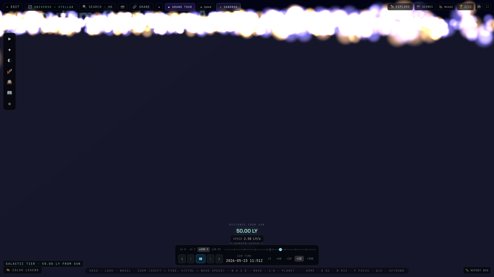</a>
      <br /><sub><b>One scene, AU↔LY tier handoff</b> — Universe Mode v2 keeps the Solar System and the Milky Way in the same Three.js scene with two coordinate frames re-anchored each tick. The bottom HUD live-reads your tier — pull out and "1.07 AU" smoothly becomes "50.00 LY" becomes "10.00 Mly". → <a href="apps/web/src/viewer/universe/">source</a></sub>
    </td>
    <td>
      <a href="https://unspeakable-world.dashable.dev/#viewer?fov=60&ra=180&dec=20&c=1&n=1&layers=gaia-stars,multimessenger,planck-polarization,chandra,variables,sky-cultures-extended">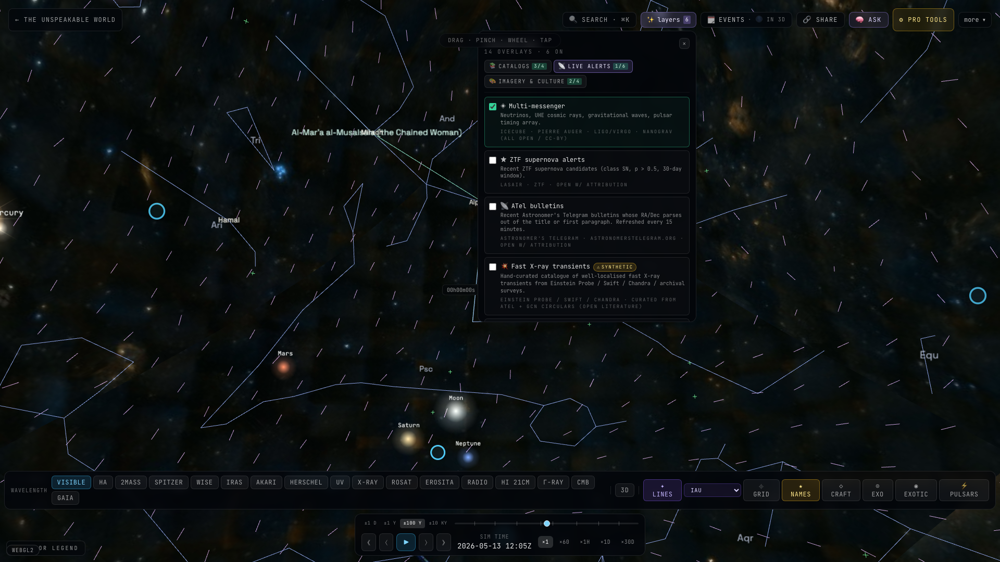</a>
      <br /><sub><b>✨ Federated layers, sub-tabbed</b> — 21 federated datasets behind one button, grouped into Catalogs · 3D structure · Live alerts · Imagery & culture. Each layer dynamic-imports its module on first toggle so the landing bundle stays at 67 KB gzipped. The full <code>?layers=</code> selection round-trips through the URL hash. → <a href="apps/web/src/viewer/extra-layers/">source</a></sub>
    </td>
  </tr>
  <tr>
    <td>
      <a href="https://unspeakable-world.dashable.dev/#universe">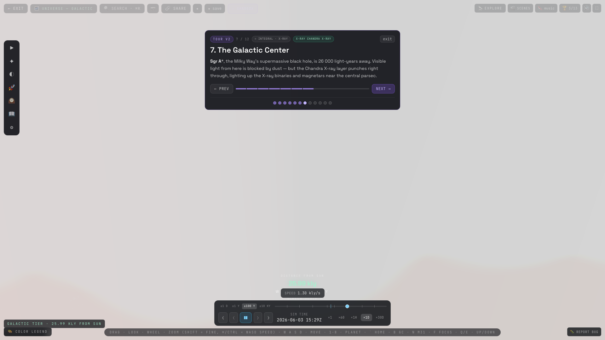</a>
      <br /><sub><b>The 12-step Grand Tour v2</b> — Earth → the Sun → the planets → the nearest star → the local neighborhood → Sgr A* (shown here) → multi-messenger → CMB → cosmic web → heat death. Each step nudges layers + wavelength so the right story tells itself. → <a href="apps/web/src/viewer/tour/">source</a></sub>
    </td>
    <td>
      <a href="https://unspeakable-world.dashable.dev/#viewer?fov=1.0&ra=10.6847&dec=41.269&w=2mass&mix=0.5">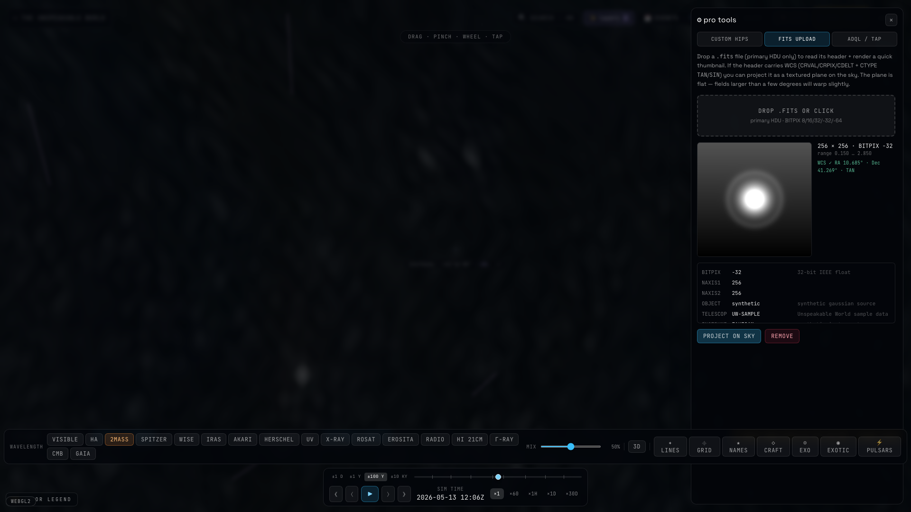</a>
      <br /><sub><b>Drop a FITS, project it on the sphere</b> — power-user tools read your file's WCS in the browser (no upload), stretch the pixels, and mount the image at its true (RA, Dec) on the celestial sphere. Side-by-side with ADQL/TAP and custom HiPS root URLs. → <a href="apps/web/src/viewer/power-user/">source</a></sub>
    </td>
  </tr>
  <tr>
    <td>
      <a href="https://unspeakable-world.dashable.dev/#viewer?fov=90&ra=266.4&dec=-29&w=wise&mix=0.6&layers=planck-polarization">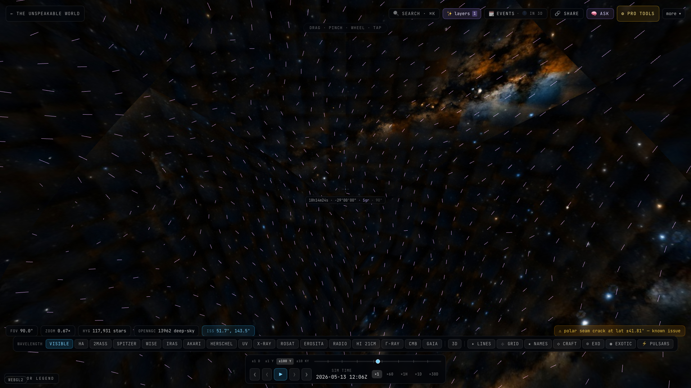</a>
      <br /><sub><b>Real Planck polarization, vectorised</b> — the v4 polarization layer renders Planck PR3 SMICA Q/U as oriented dashes along the dust-derived field lines. The vectors clearly streak along the galactic plane — exactly the foreground pattern Planck published. → <a href="apps/web/src/viewer/planck-polarization/">source</a></sub>
    </td>
    <td>
      <a href="https://unspeakable-world.dashable.dev/#class">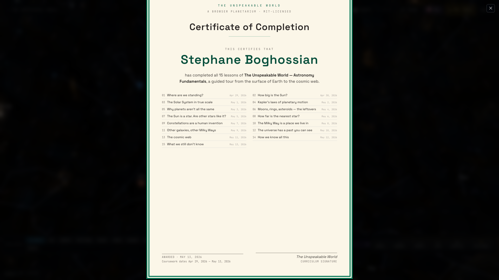</a>
      <br /><sub><b>15 lessons, one printable certificate</b> — the curriculum modal opens automatically when the learner finishes lesson 15. No accounts, no email; the name is typed once, persists in localStorage, and prints to A4. → <a href="apps/web/src/viewer/curriculum/">source</a></sub>
    </td>
  </tr>
</table>

> Re-capture: `node tools/capture-v4-screenshots.mjs` (defaults to prod), or `--target http://localhost:4173` after `pnpm --filter @unspeakable/web preview`. `--list` to see the shot names, `--only NAME` for a single shot.

---

## ✨ v4 — Federated data sweep

A 21-dataset push that turns the viewer into a live wide-area data portal.
Everything is federated (we host none of it), opt-in (off by default), and
exposed behind one ✨ **layers** button in the top bar. Toggles deep-link
into the URL hash — share a link, restore the exact stack of overlays.

- **🛰 6 new HiPS surveys** — **Pan-STARRS DR1** (deep optical) ·
  **SDSS9** · **DESI Legacy DR10** · **VLASS** (3 GHz radio) ·
  **TGSS** (150 MHz radio) · **HST** colour mosaic — all stream from
  CDS / IRSA / ESASky into the existing wavelength cross-fader.
- **⭐ Gaia DR3 — 1M stars.** A binary-packed bright slice of the 1.8 B
  Gaia catalog, GPU-instanced over the HYG field; parallax-distance
  coloured.
- **🪐 6,286 confirmed exoplanets** from the NASA Exoplanet Archive,
  cross-joined with the **PHL habitability index** so the inspector
  reads "ESI 0.84 · habitable-zone optimistic" where applicable.
- **🔭 Chandra Source Catalog 2.1** — 84 brightest X-ray sources as a
  cyan ring field, with hardness-ratio shaders.
- **🌍 TESS TOI — 7,931 planet candidates** as faint orange dots, plus
  **ASAS-SN VSX 72 variables** (eclipsing binaries, Mira, RR Lyrae)
  with light-curve sparklines in the inspector.
- **🌌 2MRS + 6dFGS galaxy cone — 136,596 galaxies in true 3D.** Fly
  past the Local Group and watch the Great Attractor wall scroll past.
- **📡 Multi-messenger sky** — IceCube neutrino tracks · Auger UHECR
  arrival directions · LIGO GWTC-3 90% localisation contours · NANOGrav
  pulsar-timing-array sources, the last with audio chirps re-synthesised
  from the published inspiral parameters.
- **⚡ ZTF / Lasair live transients** + **JPL Sentry NEO impact risk
  table** + **Starlink TLEs** (opt-in — off by default; thousands of dots
  is a lot of dots).
- **🌀 Planck E/B polarization** sky layer alongside the existing T-map.
- **🏃 CosmicFlows-4** peculiar-velocity field — see the local universe
  fall toward the Great Attractor as colour-coded vectors.
- **🛐 12 sky cultures** (Western · Chinese · Polynesian · Lakota plus 8
  more from Stellarium-Skycultures): Inuit, Egyptian, Maori, Navajo,
  Sami, Korean, Romanian, Tongan.
- **🌃 Globe at Night** citizen-science light-pollution submissions
  rendered as ground points, complementing the Bortle layer.
- **🪐 OPAL Hubble outer-planet portraits** updated yearly (the
  best Jupiter / Saturn / Uranus / Neptune full-disk imagery in
  existence) + **Mars Rover Image of the Day** from the
  Perseverance / Curiosity feeds on the planet-surface scene.

The new ✨ panel is dynamic-imported per layer so the landing bundle is
unchanged — modules only download the moment you flip a toggle on.

---

## 🆕 v3 — the educational reference release

A focused sprint to push UW from "richest viewer in the field" to "first
credible educational reference product." Highlights:

- 🎓 **Curriculum** — 8 lessons (~50 min) with narrated camera tours and
  end-of-lesson quizzes. Progress saves in `localStorage`. Lessons:
  *Where are we standing? · How big is the Sun? · The Solar System in
  true scale · Kepler's laws · Why planets aren't all the same · Moons,
  rings, asteroids · The Sun is a star · How far is the nearest star?*
- 📜 **Citations + glossary** — 100 named objects ship with a one-paragraph
  "why this matters" + SIMBAD / Wikipedia / ADS / primary-source links;
  98 astronomy terms have hover-to-define glossary tooltips.
- 👽 **SETI / Aliens / UAP / Biosignatures** — evidence-based catalog: 5
  candidate signals, 3 interstellar visitors, 6 biosignature exoplanets
  (K2-18b et al.), 5 famous UAP cases with skeptical framing, Drake
  equation interactive sliders, 9 Fermi-paradox answers.
- 📰 **Space news + launches** — live feed from Spaceflight News API +
  Launch Library 2 (upcoming launches w/ T-minus countdown).
- 🔍 **Common space myths** — 52 myths debunked across 6 categories
  (Solar System / Stars / Cosmology / Space Travel / Physics / History),
  each cited.
- ⚖ **Side-by-side compare** — pin any two of 54 objects at matched
  physical scale, from a human (1.7 m) to IC 1101 (6 Mly).
- ✨ **Star trails** — long-exposure overlay (15 min → 8 h sweep).
- 📐 **Distance ruler** — two-click great-circle measurement with
  human-readable equivalents ("47° · ~94 full moons").
- 🧬 **Planet cross-section** — interior layers for all 10 solar bodies.
- 🌌 **Planck CMB sky layer** — toggle the 13.8 Gyr-old sky into the
  existing wavelength cross-fader.
- ☀ **SDO live Sun** — the Sun mesh tries to load AIA 193 Å live
  imagery; falls back to procedural granulation if CORS blocks.
- 🌅 **APOD daily card** — NASA Astronomy Picture of the Day on the
  landing page.
- 🛐 **Sky cultures toggle** — Western IAU / Chinese / Polynesian /
  Lakota constellation traditions.
- 🌃 **Bortle-scale light pollution** — pick your dark-sky class; tonight
  panel filters fainter targets out.
- 🌀 **Black-hole lensing visual** — Doppler-beamed accretion disk +
  Einstein-ring halo on every named BH landmark.
- 🪨 **Procedural moon textures** — all 15 named moons (Mimas's Herschel,
  Enceladus's tiger stripes, Iapetus's walnut seam, Triton's cantaloupe).
- 🌟 **Open + globular cluster 3D point fields** — Pleiades / Hyades /
  M13 / Omega Cen + 9 more rendered as actual star scatter, not just
  labels.
- 🔗 **Embed mode** — `?embed=1` strips all chrome for iframe-on-blog use;
  3 ready-to-paste examples at `/embed.html`.

Built CLAUDE-friendly: every commit conventional, every push on `main`,
every dataset federated (R2 free egress), all logging through
`apps/web/src/lib/logger.ts`. MIT throughout.

---

## What you can do, today

**Drag the sky.** Pinch / wheel to zoom. Tap any region to fly there. The viewer streams real DSS2 sky tiles from CDS Strasbourg onto a 3D Three.js sphere — when you zoom in, higher-order Norder 1+ tiles fetch into the camera frustum.

**Cross-fade wavelengths.** Visible (DSS2) ↔ near-IR (2MASS) ↔ mid-IR (AllWISE) ↔ X-ray (INTEGRAL). Slide the mix between two layers and watch the sky transform — galactic dust appears, hot dust glows red, X-ray binaries flare into view.

**Click anything → ask SIMBAD + Wikipedia.** Tap a region on the sky and the inspector resolves the closest known object via CDS's open SIMBAD endpoint, then chains to Wikipedia for the article extract + thumbnail when one exists.

**Search anything.** ⌘K opens search across 314 named stars, 879 deep-sky objects (Messier + NGC/IC + common-name aliases like "Crab Nebula" or "Pleiades"), 9 solar bodies, and the 88 IAU constellations. Click any result to fly there.

**Take the Grand Tour.** Click ▶ TOUR for an 8-step guided walkthrough — Sun, Andromeda, Pleiades, Orion Nebula, Galactic Center, Crab Nebula, Large Magellanic Cloud, Jupiter — each automatically switching to the wavelength that tells the best story.

**Tonight's sky from your location.** ↑ TONIGHT'S SKY uses geolocation (button-gated) + IAU sidereal-time math to fly the camera straight up from where you are right now. Your coordinates never leave your device.

**Real solar system.** Sun, Moon, and 8 planets via [AstronomyEngine](https://github.com/cosinekitty/astronomy). Time slider scrubs ±days, with ×60 / ×1h / ×1d / ×30d speeds — watch Mars cross the sky, watch the Moon track its phase.

**Live ISS.** Polls `wheretheiss.at` every 4 s. Click "ISS" in the targets menu and the camera flies to wherever the station is right now.

**88 constellations + labels.** Toggle ✦ LINES for the IAU constellation lines from d3-celestial, with the 3-letter code at every centroid.

**8,921 bright stars + 879 deep-sky objects.** HYG v4.0 stars (CC BY-SA, 139 KB packed binary) GPU-instanced with B-V → RGB color, plus OpenNGC's bright filtered subset as type-coded ring markers (galaxy / cluster / nebula).

**Shareable URLs.** Every camera state, FOV, time, overlay + mix, constellation toggle, and now the full ✨ federated-layers selection round-trips via the URL hash — copy-paste any view to share exactly what you see, every Gaia / Chandra / multi-messenger overlay included.

---

**★ Favorites.** Click any sky object → tap ☆ in the inspector to save it. The ★ menu in the top bar holds your saved targets, persists in `localStorage`, and one-click flies to any of them. 50-target cap, newest-first.

**🔭 Tonight's targets.** The 🔭 button ranks the catalog (named stars + Messier + bright NGC/IC) by what's currently above 15° at your location, weighted by brightness and altitude. One click to fly. Auto-refreshes every 60 s as the sky rotates.

**☀ Live space weather.** A live Kp badge in the top bar polls NOAA SWPC every 5 minutes — even when closed — and goes amber / red the moment a geomagnetic storm hits. Open it for the current planetary K-index, the R / S / G NOAA scales, and the latest ALERT / WATCH / WARNING messages.

**🌅 Tonight's window per target.** Click any sky object and the inspector shows when it rises, transits, and sets at your latitude — plus a 24-hour altitude sparkline so you can see at a glance whether the target's worth chasing tonight, when it peaks, and how high it'll get. Pure analytical hour-angle math, no API.

---

**⌖ Coordinate grid + named landmarks.** Toggle the equatorial mesh (RA meridians + Dec parallels), the celestial equator, the **ecliptic** (the Sun's path through the year), and the **galactic plane** as four colour-coded great circles. Sgr A* (the galactic center), the galactic poles, the vernal & autumnal equinoxes, and both solstices ride the grid as labelled chips so the lines mean something.

**★ Named bright stars.** Toggle name labels for the top-60 brightest HYG stars — Sirius, Vega, Betelgeuse, Polaris, Rigel, Aldebaran, Capella, Antares, Arcturus, Procyon — sprite-rendered with a glow halo so they read on top of bright HiPS regions.

**🗓 Upcoming sky events.** A 90-day forward calendar of moon quarters, lunar + solar eclipses, Mercury & Venus greatest elongations, Mars / Jupiter / Saturn oppositions, equinoxes, solstices, and the major meteor-shower peaks (Quadrantids, Lyrids, Eta Aquariids, Perseids, Orionids, Leonids, Geminids, Ursids). Pure ephemeris compute via AstronomyEngine.

**🎯 Center HUD.** A faint crosshair and a tiny readout of where the camera is pointing — sexagesimal RA/Dec, the IAU constellation the line of sight lands in, and the current FOV. Auto-hides when an inspector or modal is open.

**📷 Snapshot.** One tap saves the exact view you're looking at as a timestamped PNG.

**🌌 More wavelengths.** Visible (DSS2) · Hα Finkbeiner · 2MASS near-IR · AllWISE mid-IR · GALEX UV · INTEGRAL X-ray · NVSS 1.4 GHz radio · Fermi LAT 1-300 GeV γ-ray. Eight wavelength windows, federated from CDS Strasbourg + ESAC.

**🌠 Aurora outlook.** When you've shared your location, the space-weather panel maps the live planetary K-index to NOAA's equatorward-aurora-boundary table and tells you in one sentence whether tonight's storm is overhead, on your poleward horizon, or below it.

**📱 Installable.** PWA manifest, Apple touch icons, and standalone display mode — add to home screen on iOS/Android, launches into the viewer fullscreen.

**ℹ Credits panel.** Press `i` to see every data source, API, and library the viewer depends on, with licenses — required by CC-BY-SA attribution for HYG and OpenNGC; required by basic decency for everyone else.

**🪐 Galilean moons.** Zoom in past 6° FOV near Jupiter and Io / Europa / Ganymede / Callisto resolve from the planet sprite, with their geocentric positions computed live from `JupiterMoons()` ephemerides.

**🛰 Iconic spacecraft markers.** Toggle ◇ CRAFT (or press `s`) and Voyager 1, Voyager 2, Pioneer 10, Pioneer 11, New Horizons, and JWST appear as cyan markers in the sky — at their current sky direction. Click any marker to read the launch date + mission status. JWST tracks the anti-solar direction (Earth-Sun L2) live as the Sun moves.

**☀ Solar activity.** The space-weather panel now also surfaces the latest sunspot number, F10.7 cm radio flux, and ACE/DSCOVR solar wind proton speed alongside Kp / G / S / R scales and the aurora outlook.

**🚀 Lazy-loaded viewer.** Landing-page bundle is 67 KB gzipped — the Three.js + AstronomyEngine + HiPS streaming code only downloads when you click "Launch the viewer."

---

## v3 — Solar System Flight + Gravity Sandbox

**🚀 [/#solar — Solar System Flight Mode](https://unspeakable-world.dashable.dev/#solar).** A separate 3-D heliocentric view where the camera flies around the Sun in true heliocentric coordinates (1 AU = 1 unit). Each planet sits at its real `HelioVector()` position, with a one-period sampled elliptical orbit drawn behind it. **Textured Earth** with continents + atmosphere glow. **Saturn with rings** (Cassini Division included). **Jupiter with all four Galilean moons** orbiting in 3D. **Mars with Phobos + Deimos**. **30K background stars** with full constellation context (50 brightest stars labelled, 73 cosmic landmarks visible). **Solar zones** overlay: habitable zone, frost line, asteroid belt, Kuiper belt as colour-coded ring loops.

**🛰 935 real satellites** with live SGP4 propagation. Sourced from Celestrak's TLE feeds (stations + GPS + Galileo + GEO + Intelsat + Iridium NEXT + science + amateur — Starlink intentionally excluded as visual noise). Each frame's tick re-propagates every TLE for the current sim time, draping a halo of cyan dots around Earth that actually move as time scrubs.

**⚛ Gravity Sandbox.** Open the orange ⚛ SANDBOX panel in solar flight, pick a projectile (Comet · Earth-class · Jupiter-class · Brown Dwarf · White Dwarf · Neutron Star · Black Hole), set launch speed (5–200 km/s), hit ▶ LAUNCH, and watch it leapfrog under n-body integration with the Sun + four gas giants. Up to 15 simultaneous projectiles, each with a 400-point trail.

**⊙ Tracking Mode + Vicinity Auto-Label.** Camera glues to the focused body as it orbits (toggleable). The bottom bar reads out which named scale region you're in: Inner Sun · Earth Vicinity · Inner Solar System · Asteroid Belt Region · Jupiter Region · Saturn Region · Outer Solar System · Inner Heliosphere · Heliopause / Local Bubble · Interstellar Backdrop.

**⟲ Now button.** One click resets simulation time to wall-clock now.

**🎓 Interactive tutorial.** 8-step overlay that walks first-time visitors through the gestures, the 8 wavelengths, the layer toggles, Solar Flight, the Gravity Sandbox, and Tonight's Sky.

**⚡ 3,927 SIMBAD pulsars** as a toggleable amber field on the celestial sphere.

---

The full plan lives in [`tasks/todo.md`](./tasks/todo.md). Every commit lands on `main` and pushes here. **No private branches, no stealth — every dragon is a public issue.**

---

## The wedge

Existing tools split the sky into fragments:

- **NASA Eyes** is a spacecraft viewer (no stars, no deep sky).
- **Stellarium Web** is a 2D planetarium (no 6DOF flight).
- **Aladin Lite** is a 2D sky atlas (gorgeous, but no spaceflight UX, and GPL).
- **VelonSpace / AstroGrid** has 6DOF in browser but no real survey data.
- **SpaceEngine / Celestia / OpenSpace** are gorgeous, but desktop-only.

**Nobody had built `HEALPix tile streaming + free 6DOF Three.js camera + multi-wavelength toggle + tonight's sky` in one browser tab.**

So we did. Permissively-licensed, in 7 days, in public.

---

## The three-layer stack

```
Layer 3 — Daily-use hooks      tonight's sky · ISS passes · live alerts (ZTF, GCN)
Layer 2 — Grounded AI brain    "what am I looking at?" with citations
Layer 1 — HEALPix-3D engine    1,400 sky surveys, every wavelength
```

Layer 1 + a sliver of Layer 3 ship today. Layer 2 follows.

---

## Stack

```
Frontend     Vite 6 · React 19 · TypeScript strict · Tailwind CSS
3D           Three.js r171+ (WebGL2 today; WebGPU later)
HEALPix      @hscmap/healpix (MIT, pure TS) — math by F.-X. Pineau & cdshealpix
Catalogs     HYG v4.0 → 139 KB binary (etl/hyg-bright.mjs at build time)
Ephemeris    AstronomyEngine (MIT, 100 KB)
Federation   SIMBAD (CORS open) · CDS HiPS tiles · wheretheiss.at
Hosting      Cloudflare Pages + named tunnel (free tier)
Build        pnpm workspaces + Turborepo
```

Every dependency is MIT, Apache-2.0, BSD, or public domain. **No GPL, no AGPL.**

---

## Data sources (federated, never re-hosted at petabyte scale)

- **HiPS surveys** at CDS Strasbourg, NASA IRSA, ESA ESASky — gamma → radio, ~1,400 surveys including DSS2, 2MASS, AllWISE, GALEX, INTEGRAL, NVSS, Fermi-LAT, Planck T/E/B, **Pan-STARRS DR1**, **SDSS9**, **DESI Legacy DR10**, **VLASS**, **TGSS**, and the **HST** colour mosaic
- **SIMBAD** — federated cone search via CDS Strasbourg (CORS-open, no proxy)
- **HYG v4.0** — 8,921 bright stars (CC BY-SA 2.5)
- **Gaia DR3** — 1M-star bright slice via CDS VizieR
- **NASA Exoplanet Archive** — 6,286 confirmed exoplanets (TAP)
- **PHL @ UPR Arecibo** — habitability index (ESI / SPH)
- **Chandra Source Catalog 2.1** — 84 brightest X-ray sources
- **TESS TOI** — 7,931 planet candidates (MAST)
- **ASAS-SN VSX** — 72 bright variables with light curves
- **2MRS + 6dFGS** — 136,596 galaxies in 3D (IPAC)
- **IceCube · Auger · LIGO GWTC-3 · NANOGrav** — multi-messenger event streams
- **ZTF / Lasair** — live transient alerts
- **JPL Sentry** — near-Earth-object impact risk table
- **Celestrak** — Starlink + science satellite TLEs (opt-in)
- **CosmicFlows-4** — local-universe peculiar velocities (Tully et al.)
- **Stellarium Skycultures** — 12 cultural constellation traditions (GPL data, MIT-compatible CC re-encoding)
- **Globe at Night** — citizen-science light pollution reports
- **NASA OPAL** — yearly HST outer-planet portraits
- **NASA Mars Rover (Perseverance / Curiosity)** — Image of the Day feeds
- **AstronomyEngine** — solar system positions, no ephemeris files
- **wheretheiss.at** — live ISS sub-satellite point
- **JPL Horizons + SPICE kernels** — every spacecraft trajectory ever flown (Phase 2)

---

## Repo layout

```
apps/
  web/          Vite + React main app
    src/viewer/
      scene/    Three.js scene · HEALPix sphere · LOD · Voyager controls
      hips/     Survey definitions + tile loader
      stars/    HYG bright-star field with B-V color shader
      solar/    Sun + Moon + planets via AstronomyEngine
      iss/      Live ISS tracker
      info/     SIMBAD client + ASCII parsers
      ui/       TimeStrip · WavelengthBar · QuickTargets · InfoPanel
  etl/          HYG → binary build pipeline (Node)
packages/       Reserved for the production renderer extraction
docs/
  screenshots/  Visual proof per phase
tasks/
  todo.md       Day-by-day plan (you are reading the meta version)
```

---

## Build in public — daily commits

| Day | Commit  | What shipped                                                     |
| --- | ------- | ---------------------------------------------------------------- |
| 1   | a03d0e2 | Bootstrap monorepo + landing page + Cloudflare tunnel            |
| 2   | 82e8eb2 | HEALPix toy + DSS2 streaming + Voyager camera                    |
| 3   | 83b5439 | LOD switching + touch + inertia + chips + tap-to-fly             |
| 4   | c3177f5 | HYG bright stars + AstronomyEngine + time strip                  |
| 5   | 5234e10 | Multi-pointer + Y-up coords + ISS tracker + Quick Targets        |
| 6.A | a6fa461 | Multi-wavelength toggle (Visible / 2MASS / WISE) with cross-fade |
| 6.B | 3ad41d3 | SIMBAD info panel — click sky, ask "what am I looking at"        |
| 7   | 777de83 | v1 public launch · README · OG card · landing polish             |
| 8   | 9d6c7f6 | Tonight's sky — geolocation → fly to your zenith                 |
| 9   | 2bafb13 | Polar Collignon seam tightened (SUB 16→32)                       |
| 10  | 934cfae | Messier + bright NGC overlay (879 deep-sky rings)                |
| 11  | 240fe83 | 88 IAU constellation lines (toggleable)                          |
| 12  | 28f8307 | INTEGRAL hard X-ray as 4th wavelength layer                      |
| 13  | 7602ed4 | Top-bar search across stars / DSO / planets / constellations     |
| 14  | bd9511a | Mobile UX — top bar collapses to icons; engineering chrome hides |
| 15  | 2cea894 | Grand Tour — 8-step guided sky walkthrough with auto-wavelength  |
| 16  | 3c4b052 | URL deep-linking — every view is a shareable hash                |
| 17  | e8c1b4c | Wikipedia summary in the SIMBAD inspector                        |
| 18  | f1d0f27 | Famous-object alias map ("Crab" → M1, "Pleiades" → M45)          |
| 19  | 56eebf0 | 88 constellation labels at line centroids                        |
| 20  | (v2)    | v2 ship — refreshed README · OG card · landing roadmap update    |
| 21  | 5ff0ae7 | v4.A — six new HiPS surveys (Pan-STARRS · SDSS9 · DESI · VLASS · TGSS · HST) |
| 22  | 549633a | v4.B — extra-layers swarm (Gaia DR3, exoplanets, Chandra, TESS, ZTF, multi-messenger, …) |
| 23  | (this)  | v4 ship — README refresh · ✨ layer toggles deep-linked into URL hash |

---

## Acknowledgements

Built on the shoulders of:

- **CDS Strasbourg** — HiPS, SIMBAD, VizieR. The IVOA's beating heart.
- **NASA / ESA / JAXA / ISRO / CNSA** — every public-domain image and trajectory.
- **F.-X. Pineau & the cdshealpix team** — the HEALPix math that makes this possible.
- **Don Cross** — [AstronomyEngine](https://github.com/cosinekitty/astronomy).
- **Three.js community** — the renderer everyone deserves.
- **astronexus** — [HYG database](https://github.com/astronexus/HYG-Database) (CC BY-SA 2.5).
- **wheretheiss.at** — free live ISS API.

---

## License

MIT. See [LICENSE](./LICENSE).

Data attribution per source (CC-BY almost universally).
